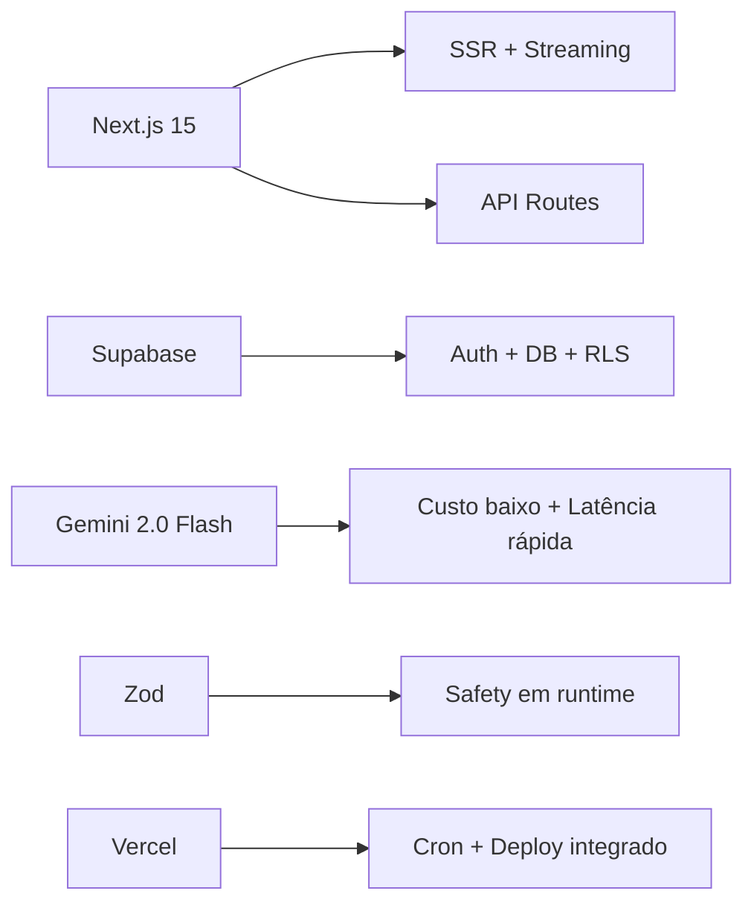
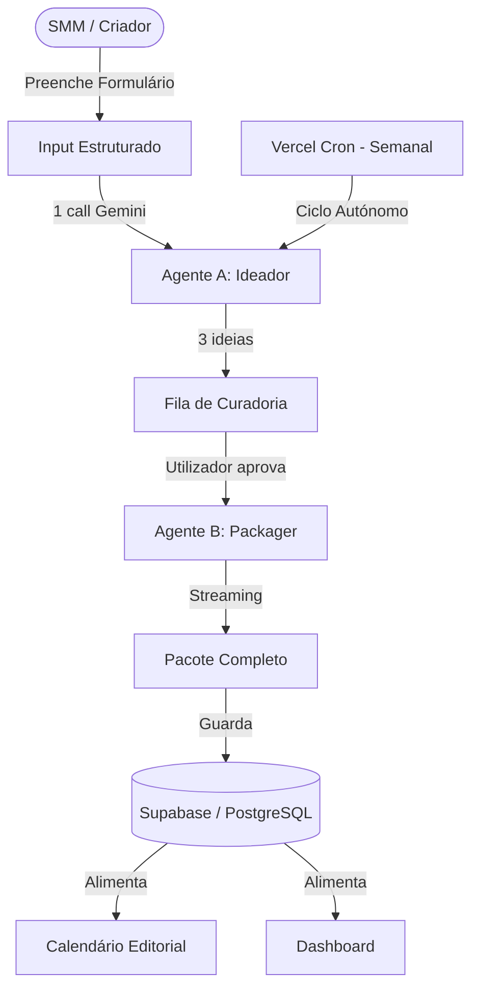

<div align="center">
  <br />
  <h1>☕ Zenith CIS</h1>
  <p><strong>Content Intelligence System</strong></p>
  <p><em>Copiloto de Marketing Autónomo & Orientador de Storytelling</em></p>
  <p>Para o <strong>Zenith Caffè</strong> — Mercados de Portugal e Espanha</p>
  <br />
</div>

<div align="center">


</div>

---

## 📋 Índice

- [Visão Geral](#-visão-geral)
- [Funcionalidades](#-funcionalidades)
- [Stack Tecnológica](#-stack-tecnológica)
- [Arquitetura](#-arquitetura)
- [Sistema de Agentes](#-sistema-de-agentes)
- [Estrutura do Projeto](#-estrutura-do-projeto)
- [Guia de Início Rápido](#-guia-de-início-rápido)
- [Autenticação](#-autenticação)
- [API Endpoints](#-api-endpoints)
- [Variáveis de Ambiente](#-variáveis-de-ambiente)
- [Scripts Disponíveis](#-scripts-disponíveis)
- [Roadmap](#-roadmap)
- [Licença](#-licença)

---

## 👁️ Visão Geral

O **Zenith Content Intelligence System (CIS)** é uma plataforma SaaS que funciona como um **copiloto de marketing** para a equipa de Social Media do **Zenith Caffè**. O sistema automatiza e acelera a criação de conteúdo para Instagram, utilizando inteligência artificial generativa (Gemini 2.0 Flash) para produzir ideias, roteiros, legendas, prompts visuais e estratégias de crescimento — tudo adaptado aos mercados de **Portugal** e **Espanha**.

### Problema que Resolve

A equipa de marketing do Zenith Caffè geria **30+ posts/mês** em **2 mercados** e **3 idiomas** (PT-PT, ES-ES, EN) manualmente, com:
- ❌ **Horas perdidas** em brainstorming criativo
- ❌ **Inconsistência** no tom de voz entre mercados
- ❌ **Dificuldade** em manter um calendário editorial consistente
- ❌ **Erros linguísticos** (PT-BR em vez de PT-PT)

### Solução

O CIS reduz o tempo de criação de conteúdo de **horas para minutos**, mantendo consistência de marca e adaptação linguística automática.

---

## ✨ Funcionalidades

### 🎯 Fase de Ideação
| Funcionalidade | Descrição |
|----------------|-----------|
| **Briefing Intuitivo** | Formulário estruturado para mood, público-alvo e objetivos |
| **Geração Automática de Ideias** | IA produz 3 conceitos criativos por briefing |
| **Fila de Curadoria** | Revê, aprova ou descarta ideias pendentes |

### 📦 Geração de Pacotes Completos
| Funcionalidade | Descrição |
|----------------|-----------|
| **Roteiro Detalhado** | Script cena-a-cena para Reels/Stories/Carrossel |
| **Legendas Multilingue** | PT-PT, ES-ES e EN — sem erros de PT-BR |
| **Prompts Visuais** | Instruções para Midjourney v6 e Runway Gen-3 |
| **Estratégia de Growth** | CTAs, hashtags, geotags e stickers interativos |

### 📅 Gestão Editorial
| Funcionalidade | Descrição |
|----------------|-----------|
| **Dashboard** | Visão geral de métricas e conteúdo pendente |
| **Calendário Editorial** | Planeamento visual de publicações |
| **Ciclo Autónomo Semanal** | Cron job semanal gera ideias automaticamente |
| **Streaming em Tempo Real** | Conteúdo aparece à medida que é gerado |

---

## 🚀 Stack Tecnológica

| Camada | Tecnologia | Versão | Propósito |
|--------|-----------|--------|-----------|
| **Framework** | [Next.js](https://nextjs.org/) | 15.1 (App Router) | Server Components, Route Handlers, Streaming SSR |
| **Linguagem** | [TypeScript](https://www.typescriptlang.org/) | 5.7 (Strict) | Type safety em toda a codebase |
| **Estilização** | [Tailwind CSS](https://tailwindcss.com/) | 3.4 | Utility-first, responsivo |
| **Database & Auth** | [Supabase](https://supabase.com/) | — | PostgreSQL, Autenticação, RLS |
| **Orquestração IA** | [Gemini 2.0 Flash](https://deepmind.google/technologies/gemini/flash/) | — | Geração de conteúdo criativo |
| **Hospedagem** | [Vercel](https://vercel.com/) | — | Deploy, Cron Jobs, Edge Functions |
| **Validação** | [Zod](https://zod.dev/) | 3.24 | Runtime type validation (env, API, agentes) |
| **Formatação** | [Prettier](https://prettier.io/) | 3.4 + Tailwind plugin | Código consistente |

### Porquê estas escolhas?



- **Next.js 15**: Server Components eliminam JavaScript desnecessário do bundle; streaming permite feedback em tempo real
- **Gemini 2.0 Flash**: Custo ~0.15€/1M tokens vs 3.50€ do Pro — ideal para MVP com muitas iterações
- **Supabase**: Stack completa (DB + Auth + Storage) com RLS nativo e sem custos de servidor dedicado
- **Zod**: Validação partilhada entre frontend, API e agentes — um schema, três usos

---

## 🏗️ Arquitetura

### Visão Geral do Sistema



### Fluxo de Criação de Conteúdo

```
┌─────────────┐    ┌─────────────┐    ┌─────────────┐    ┌─────────────┐
│   Briefing  │───▶│   Ideador   │───▶│   Curadoria │───▶│   Packager  │
│  (Formulário)│    │  (3 Ideias) │    │ (Aprovação) │    │ (P. Completo)│
└─────────────┘    └─────────────┘    └─────────────┘    └─────────────┘
                                                            │
                                                            ▼
                                                     ┌─────────────┐
                                                     │  Streaming  │
                                                     │  (Tempo Real)│
                                                     └─────────────┘
```

### Pipeline de Streaming

O Packager envia eventos SSE ao cliente para feedback em tempo real:

```
Cliente                    Servidor (Gemini)
   │                            │
   │  POST /api/ideas/approve   │
   │───────────────────────────▶│
   │                            │
   │  { step: "copywriting", status: "started" }  │
   │◀───────────────────────────│
   │                            │
   │  { step: "copywriting", data: { scriptFlow, captions } }  │
   │◀───────────────────────────│
   │                            │
   │  { step: "prompting", status: "started" }  │
   │◀───────────────────────────│
   │                            │
   │  { step: "prompting", data: { visualPrompts } }  │
   │◀───────────────────────────│
   │                            │
   │  { step: "growth", status: "started" }  │
   │◀───────────────────────────│
   │                            │
   │  { step: "complete", packageId: "UUID" }  │
   │◀───────────────────────────│
```

### Decisões Arquiteturais Chave

#### 1. Dois Agentes em vez de Cinco
A análise crítica identificou overengineering na proposta original de 5 agentes. O MVP foi simplificado para **2 agentes** que fazem o mesmo trabalho:

| Proposta Original | Simplificação MVP | Ganho |
|:---|:---|:---|
| 5 agentes em cadeia | 2 agentes (Ideador + Packager) | -60% calls à API, -60% complexidade |

#### 2. Modelo Único — Gemini 2.0 Flash
Gerir dois modelos (Pro + Flash) adiciona complexidade de roteamento sem ganho imediato. O MVP usa exclusivamente **Gemini 2.0 Flash**.

#### 3. Execução Sequencial com Streaming
Em vez de executar agentes em paralelo (risco de estado parcial em Serverless), o MVP executa **sequencialmente** com **streaming** para o cliente — a latência percebida é menor porque o conteúdo aparece gradualmente.

#### 4. Base de Dados Simplificada
| Proposta Original | Simplificação MVP |
|:---|:---|
| 4 tabelas (profiles, trend_vibes, content_ideas, generated_contents) | 2 tabelas (profiles, content_packages) |

---

## 🤖 Sistema de Agentes

### Arquitetura de Agentes (Extensível)

```typescript
abstract class BaseAgent<TInput, TOutput> {
  abstract readonly name: string;
  abstract execute(input: TInput): Promise<TOutput>;

  protected async callGemini(prompt: string): Promise<string>;
  protected validateOutput<T>(data: unknown, schema: ZodSchema<T>): T;
}
```

**Pattern**: Template Method + Strategy. Cada agente estende `BaseAgent` e implementa `execute()`. Novos agentes adicionam-se sem modificar os existentes.

### Agente A — Ideador

| Campo | Descrição |
|-------|-----------|
| **Input** | Briefing: mood, público-alvo, mercado, formato, objetivo |
| **Output** | 3 ideias conceituais com título, descrição, formato e objetivo |
| **Modelo** | Gemini 2.0 Flash |
| **System Prompt** | Especialista em conteúdo criativo para redes sociais do Zenith Caffè |

### Agente B — Packager

| Campo | Descrição |
|-------|-----------|
| **Input** | Ideia aprovada + detalhes de mercado |
| **Output** | Roteiro, legendas (PT-PT/ES-ES/EN), prompts visuais (Midjourney/Runway), growth tips |
| **Modelo** | Gemini 2.0 Flash |
| **System Prompt** | Especialista em produção de conteúdo completo |

### Expandir o Sistema

Para adicionar um novo agente, basta:

```bash
src/agents/
  ├── base-agent.ts      # Classe base (já existe)
  ├── ideator/           # Agente A (MVP)
  ├── packager/          # Agente B (MVP)
  ├── reviewer/          # ★ Futuro: Revisão de conteúdo
  └── scheduler/         # ★ Futuro: Agendamento inteligente
```

---

## 📁 Estrutura do Projeto

```
zenith-cis/
├── .env.example                  # Template de variáveis de ambiente
├── .gitignore                    # Ficheiros ignorados pelo Git
├── .prettierrc                   # Configuração Prettier
├── eslint.config.mjs             # ESLint 9 (flat config)
├── next.config.ts                # Configuração Next.js
├── package.json                  # Dependências e scripts
├── postcss.config.js             # PostCSS + Tailwind
├── tailwind.config.ts            # Tema customizado Tailwind
├── tsconfig.json                 # TypeScript strict + path aliases
├── vercel.json                   # Deploy Vercel + Cron Jobs
│
├── docs/                         # Documentação do projeto
│   ├── api_spec.md               # Especificação dos endpoints
│   ├── brand_voice_and_prompts.md# Tom de voz e instruções dos agentes
│   ├── setup_guide.md            # Guia de configuração
│   └── supabase_rls_policies.md  # Políticas de segurança RLS
│
├── supabase/
│   └── migrations/
│       └── 001_initial_schema.sql# Schema inicial da base de dados
│
└── src/                          # Código fonte
    ├── app/                      # Next.js App Router
    │   ├── (dashboard)/          # Layout autenticado (Route Group)
    │   │   ├── layout.tsx        # Layout protegido com Header
    │   │   ├── dashboard/        # Página de dashboard
    │   │   ├── ideas/            # Fila de ideias + criação
    │   │   ├── calendar/         # Calendário editorial
    │   │   └── settings/         # Definições do utilizador
    │   ├── api/                  # Route Handlers
    │   │   ├── auth/user/        # GET - Sessão + perfil
    │   │   ├── cron/trend-analysis/ # GET - Ciclo autónomo semanal
    │   │   └── ideas/            # GET - Listar + POST - Aprovar
    │   ├── auth/                 # Páginas de autenticação
    │   │   ├── login/            # Login / Registo
    │   │   ├── callback/         # Callback OAuth Supabase
    │   │   ├── confirm/          # Confirmação de email
    │   │   └── logout/           # Logout endpoint
    │   ├── globals.css           # Estilos globais Tailwind
    │   ├── layout.tsx            # Root layout (fonts, providers)
    │   └── page.tsx              # Home page (redirect)
    │
    ├── agents/                   # Sistema de Agentes de IA
    │   ├── base-agent.ts         # Classe base abstrata
    │   ├── ideator/              # Agente A: Geração de ideias
    │   │   ├── types.ts          # Schemas Zod + tipos
    │   │   └── ideator-agent.ts  # Implementação
    │   └── packager/             # Agente B: Pacote completo
    │       ├── types.ts          # Schemas Zod + tipos
    │       └── packager-agent.ts # Implementação
    │
    ├── components/               # Componentes React
    │   ├── auth/                 # Login form, Auth button
    │   ├── layout/               # Header, navegação
    │   ├── providers/            # Context providers (Supabase, Auth)
    │   └── ui/                   # Placeholder shadcn/ui
    │
    ├── features/                 # Módulos de funcionalidade
    │   ├── calendar/             # ★ Placeholder (futuro)
    │   ├── ideas/                # ★ Placeholder (futuro)
    │   └── settings/             # ★ Placeholder (futuro)
    │
    ├── lib/                      # Bibliotecas e configurações
    │   ├── auth-errors.ts        # Mapeamento de erros de auth
    │   ├── env.ts                # Validação Zod de variáveis de ambiente
    │   ├── utils.ts              # Funções utilitárias (cn, formatDate)
    │   ├── gemini/
    │   │   └── client.ts         # Cliente Gemini API (sync + streaming)
    │   └── supabase/
    │       ├── admin.ts          # Cliente admin (service_role, bypass RLS)
    │       ├── client.ts         # Cliente browser (anon key)
    │       ├── middleware.ts      # Cliente Edge Middleware
    │       └── server.ts         # Cliente servidor (cookies)
    │
    ├── middleware.ts             # Next.js Middleware (proteção de rotas)
    │
    ├── services/                 # Camada de serviços
    │   ├── base-service.ts       # Serviço base (Supabase admin, logging)
    │   ├── ideas-service.ts      # Gestão de ideias de conteúdo
    │   ├── packages-service.ts   # Gestão de pacotes de conteúdo
    │   └── gemini-service.ts     # Orquestração de chamadas Gemini
    │
    └── types/                    # Tipos TypeScript partilhados
        ├── index.ts              # Re-exports
        ├── agent.ts              # Interfaces do sistema de agentes
        ├── auth.ts               # Tipos de autenticação
        ├── content.ts            # Tipos de conteúdo (ideias, pacotes)
        ├── database.ts           # Interfaces das tabelas Supabase
        └── market.ts             # Tipos de mercado (portugal | spain)
```

---

## 🚀 Guia de Início Rápido

### Pré-requisitos

- [Node.js](https://nodejs.org/) 18.x+
- [npm](https://www.npmjs.com/) ou [pnpm](https://pnpm.io/)
- Conta no [Supabase](https://supabase.com/) (gratuita)
- Chave de API no [Google AI Studio](https://aistudio.google.com/)

### Setup Local

```bash
# 1. Clonar o repositório
git clone https://github.com/Tech-ZenithCaffe/Zenith-CIS.git
cd Zenith-CIS

# 2. Instalar dependências
npm install

# 3. Configurar variáveis de ambiente
cp .env.example .env.local
# Edita .env.local com as tuas credenciais

# 4. Configurar a Base de Dados
# Abre supabase/migrations/001_initial_schema.sql no SQL Editor do Supabase

# 5. Iniciar desenvolvimento
npm run dev
```

### Configuração do Supabase

1. Criar projeto em [supabase.com](https://supabase.com/dashboard)
2. Em **Authentication → Providers**, ativar **Email/Password**
3. Em **URL Configuration**, adicionar:
   - `Site URL`: `http://localhost:3000`
   - `Redirect URLs`: `http://localhost:3000/auth/callback`
4. Executar `supabase/migrations/001_initial_schema.sql` no **SQL Editor**
5. Copiar as chaves para `.env.local`

### Variáveis de Ambiente

```ini
# ===========================================
# Supabase
# ===========================================
NEXT_PUBLIC_SUPABASE_URL=https://your-project.supabase.co
NEXT_PUBLIC_SUPABASE_ANON_KEY=your-anon-key
SUPABASE_SERVICE_ROLE_KEY=your-service-role-key

# ===========================================
# Google Gemini AI
# ===========================================
GEMINI_API_KEY=your-gemini-api-key

# ===========================================
# Vercel (Cron Security)
# ===========================================
VERCEL_CRON_SECRET=your-cron-secret
```

### Verificação

```bash
npm run typecheck   # ✅ Verificar tipos TypeScript
npm run lint        # ✅ Verificar lint
npm run dev         # ✅ Iniciar servidor
```

---

## 🔐 Autenticação

### Fluxo de Autenticação

```
Utilizador → /auth/login
  → signInWithPassword(email, password)
  → Se OK: redirect para /dashboard
  → Se erro: mensagem amigável (PT-PT)

Registo:
  → Toggle "Criar conta" no formulário
  → signUp(email, password)
  → Email de confirmação enviado
  → Link → /auth/callback → exchangeCodeForSession()
  → redirect para /dashboard
  → Trigger handle_new_user() cria perfil
```

### Tratamento de Erros (Mensagens em PT-PT)

| Erro Supabase | Mensagem |
|--------------|----------|
| `invalid login credentials` | "Email ou palavra-passe incorretos." |
| `email not confirmed` | "Confirma o teu email antes de fazer login." |
| `user already registered` | "Já existe uma conta com este email." |
| Password curta | "A palavra-passe deve ter pelo menos 6 caracteres." |

### Clientes Supabase (Três Camadas)

| Cliente | Ficheiro | Uso | Chave |
|---------|----------|-----|-------|
| **Browser** | `lib/supabase/client.ts` | Componentes React (client-side) | `anon key` pública |
| **Server** | `lib/supabase/server.ts` | Server Components, Route Handlers | `anon key` + cookies |
| **Admin** | `lib/supabase/admin.ts` | Cron Jobs, operações internas | `service_role key` (bypass RLS) |

---

## 📡 API Endpoints

| Método | Rota | Descrição | Autenticação |
|--------|------|-----------|-------------|
| `GET` | `/api/cron/trend-analysis` | Ciclo autónomo semanal (gerar ideias) | `VERCEL_CRON_SECRET` |
| `GET` | `/api/ideas` | Listar ideias pendentes | Sessão (cookie) |
| `POST` | `/api/ideas/approve` | Aprovar ideia + gerar pacote (streaming) | Sessão (cookie) |
| `GET` | `/api/auth/user` | Obter sessão + perfil atual | Sessão (cookie) |

### Exemplo: Aprovar Ideia (com Streaming)

```bash
curl -X POST http://localhost:3000/api/ideas/approve \
  -H "Content-Type: application/json" \
  -d '{"idea_id": "UUID"}'
```

Resposta (SSE):
```
{ "step": "copywriting", "status": "started" }
{ "step": "copywriting", "data": { "scriptFlow": [...], "captions": {...} } }
{ "step": "prompting", "status": "started" }
{ "step": "prompting", "data": { "visualPrompts": {...} } }
{ "step": "growth", "status": "started" }
{ "step": "growth", "data": { "growthTips": {...} } }
{ "step": "complete", "packageId": "UUID" }
```

---

## 📜 Scripts Disponíveis

| Comando | Descrição |
|---------|-----------|
| `npm run dev` | Servidor de desenvolvimento (Next.js) |
| `npm run build` | Build de produção |
| `npm run start` | Servidor de produção |
| `npm run lint` | Verificar ESLint |
| `npm run lint:fix` | Corrigir ESLint automaticamente |
| `npm run format` | Formatar código com Prettier |
| `npm run format:check` | Verificar formatação |
| `npm run typecheck` | Verificar tipos TypeScript (`tsc --noEmit`) |

---

## 🗺️ Roadmap

### MVP (Fase Atual) ✅
- [x] Setup do projeto (Next.js + TypeScript + Tailwind)
- [x] Integração Supabase (DB + Auth)
- [x] Integração Gemini 2.0 Flash
- [x] Sistema de Agentes (Ideador + Packager)
- [x] Autenticação completa (login, registo, sessão)
- [x] Dashboard com métricas
- [x] Fila de curadoria de ideias
- [ ] Página de criação de briefing
- [ ] Página de aprovação com streaming
- [ ] Calendário editorial
- [ ] Deploy Vercel + Cron Job semanal

### Versão 1.0 — Próximas Features
- [ ] Editor de conteúdo inline (arrastar, editar legendas)
- [ ] Histórico de conteúdo gerado
- [ ] Filtros por mercado (Portugal / Espanha)
- [ ] Definições de utilizador (mercado, preferências)
- [ ] Modo escuro 🌙

### Versão 2.0 — Futuro
- [ ] Agente C: Revisor de conteúdo
- [ ] Agente D: Agendamento inteligente
- [ ] Suporte a múltiplos criadores por mercado
- [ ] Dashboard analítico (engagement real)
- [ ] Supabase Storage para moodboards
- [ ] Gemini Pro para tarefas complexas (roteamento inteligente)

---

## 📚 Documentação

A documentação detalhada encontra-se na pasta `docs/`:

| Documento | Descrição |
|-----------|-----------|
| [Brand Voice & Prompts](docs/brand_voice_and_prompts.md) | Tom de voz e instruções dos agentes |
| [Supabase RLS](docs/supabase_rls_policies.md) | Políticas de segurança da base de dados |
| [API Spec](docs/api_spec.md) | Especificação dos endpoints da API |
| [Setup Guide](docs/setup_guide.md) | Guia de configuração completo |
| [Análise Crítica](zenith_critical_analysis.md) | Revisão arquitetural do MVP |

---

## 📝 Notas Técnicas

### Regras de Idioma (Crítico)

O sistema segue regras rigorosas de idioma para evitar erros comuns:

- **Mercado Portugal**: Legendas em **PT-PT** (nunca PT-BR) + versão EN
- **Mercado Espanha**: Legendas em **ES-ES** + versão EN
- **Formato Stories**: Textos em **Inglês** (EN) prioritariamente
- Termos PT-BR proibidos: "café da manhã" → "pequeno-almoço"

### Segurança

- **RLS**: Service role nos cron jobs, user context nos handlers autenticados
- **Zod**: Validação em runtime de env vars, inputs de API e outputs de agentes
- **Headers de segurança**: `X-Frame-Options: DENY`, `X-Content-Type-Options: nosniff`
- **Cron protegido**: Requer `VERCEL_CRON_SECRET` no header `Authorization`

### Performance

- **Streaming**: Respostas em tempo real via Server-Sent Events
- **2 calls API por fluxo**: Em vez de 5 na arquitetura original
- **Modelo único**: Gemini 2.0 Flash elimina overhead de roteamento

---

<div align="center">
  <br />
  <p>
    <strong>Zenith CIS</strong> — <em>Content Intelligence System</em>
  </p>
  <p>
    Feito com ☕ para o <a href="https://zenithcaffe.com">Zenith Caffè</a>
  </p>
  <p>
    <sub>Portugal · Espanha · 2026</sub>
  </p>
  <br />
</div>
